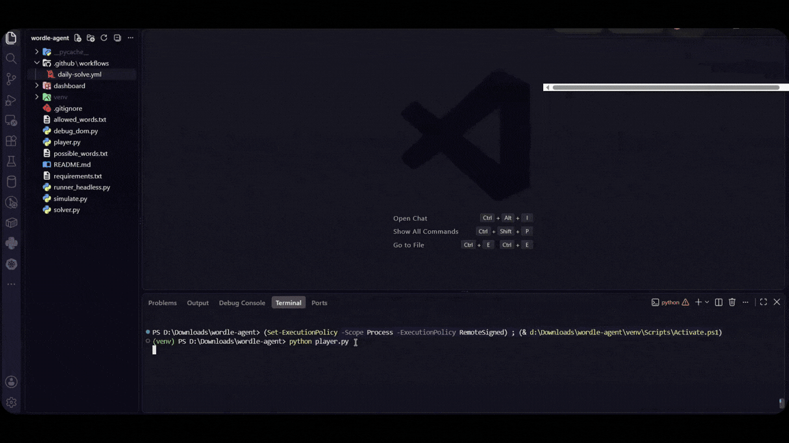
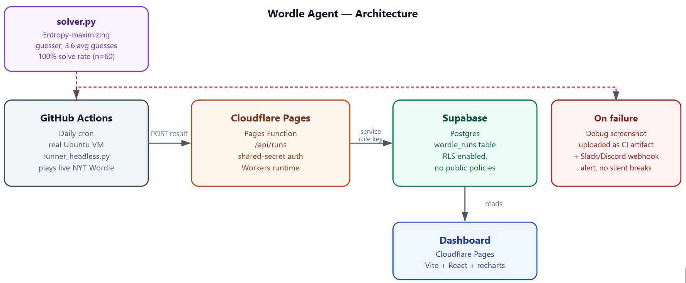

# wordle-agent

An autonomous agent that solves the live NYT Wordle using an
entropy-maximizing solver, with an optional hosted pipeline that runs it
daily and tracks results on a dashboard.


**Status: working end-to-end**, both locally and in the hosted setup
(daily GitHub Actions run → Cloudflare Pages API → Supabase → dashboard).


## How it works

- **`solver.py`** — the actual intelligence. Opens with a fixed
  high-entropy word (`salet`), then for every subsequent guess computes
  the Shannon entropy each candidate guess would induce over the
  remaining possible answers, and picks the guess with max expected
  information gain (same idea as 3Blue1Brown's Wordle solver). Once the
  candidate set narrows to ≤10 words (`CANDIDATE_ONLY_THRESHOLD`), it
  switches to guessing only from among those candidates — see
  [*Why cap the candidate pool?*](#why-cap-the-candidate-pool) below for
  why that's there.
- **`player.py`** — Playwright browser automation for a local, visible
  run. Opens nytimes.com/games/wordle, dismisses the cookie banner, the
  "Play" click, the how-to-play modal, and any stray promo/ad popups
  , types each guess via keyboard events,
  reads the resulting tile colors from `div[data-testid="tile"]`
  , and feeds the feedback back into the solver until
  solved or 6 guesses are used.
- **`runner_headless.py`** — the same flow, headless, meant for CI. After
  solving (or failing), POSTs the result to a hosted ingest API, and
  fires a Slack/Discord webhook alert if anything went wrong so failures
  don't sit silent until someone happens to check.
- **`debug_dom.py`** — diagnostic script that dumps NYT's actual DOM
  structure (custom elements, shadow roots, tile-like elements) when
  something breaks. Useful if NYT changes their markup again.
- **`simulate.py`** — offline correctness/perf benchmark, no browser
  needed. See [*Results*](#results-benchmarked-offline-no-browser) below.
- **`tests/`** — pytest coverage for the pattern-matching logic, with
  particular attention to Wordle's duplicate-letter rules (the classic
  correctness trap: green matches consume a letter instance before
  yellow matches do).

## Quick local run

```bash
pip install -r requirements.txt
python -m playwright install chromium
python player.py
```

Runs with a visible browser window by default so you can watch it play
and debug if something looks off. `DELAY_BETWEEN_ATTEMPTS` and
`DELAY_AFTER_SUCCESS` at the top of `player.py` control the pacing if you
want more time to watch each guess land.

## Results (benchmarked offline, no browser)

60 random real Wordle answers, same sample for both solvers:

| Solver | Win rate | Avg. guesses |
|---|---|---|
| **Entropy solver (this project)** | 60/60 | **3.600** |
| Naive frequency baseline | 60/60 | 3.633 |
| Published optimal ([3Blue1Brown](https://www.youtube.com/watch?v=v68zYyaEmEA)) | — | 3.420 |

The naive baseline (`NaiveFrequencySolver` in `solver.py`) picks each
guess by summing per-position letter frequency across the remaining
candidates — no information theory, just "look typical of what's left."
It's a fair baseline specifically because it shares everything else with
the real solver (same opener, same candidate filtering) and differs only
in *how* it picks the next guess, isolating the effect of the entropy
calculation itself. The entropy solver's edge here is modest on a
60-word sample (it's a stronger edge over larger samples/full solution
lists), and it lands within ~5% of 3b1b's published optimal despite using
a fixed opener rather than his fully brute-forced first guess.

### Why cap the candidate pool?

Pure entropy maximization doesn't always pick from the actual remaining
candidates — sometimes a non-candidate "probe" word splits a small
remaining set more evenly than any real candidate could, which is
optimal for expected total guesses over many games. In practice this
showed up as an actual bug report during development: with the candidate
set narrowed to `{tribe, trice, tripe, ...}`-style words after two
guesses, the solver picked `abaca` — a word sharing none of the
established letters — purely to split the remaining possibilities as
evenly as possible, rather than gambling on a direct hit.

That's mathematically defensible but *feels* wrong when you're watching
it play, because it forgoes any chance of winning on that turn in
exchange for a small expected-value improvement several games from now.
`CANDIDATE_ONLY_THRESHOLD = 10` in `solver.py` fixes this by restricting
guesses to actual candidates once the field is small: below that
threshold, every guess is instead a live shot at winning immediately,
at the cost of a marginal amount of long-run optimality. The benchmark
table above (3.600 vs the naive baseline's 3.633) reflects the solver
*with* this cap in place — it's a UX/interpretability tradeoff, not a
free lunch, but the offline simulation confirms it doesn't cost anything
measurable in this sample.

## Reliability

- **Debug screenshots on failure.** Every known failure mode (board
  never loads, a row doesn't resolve, the candidate list runs dry)
  captures a screenshot before giving up, uploaded as a CI artifact on
  the failed Actions run — the system leaves visual evidence rather than
  just a stack trace.
- **Failure webhook.** Set the `FAILURE_WEBHOOK_URL` secret (a Slack or
  Discord incoming webhook) and `runner_headless.py` will post an alert
  the moment something breaks — DOM mismatch, unhandled exception, or a
  genuine 6-guess loss — instead of failing silently until the daily
  dashboard update stops showing up.
- **"Days since last failure"** is tracked on the dashboard as a rough
  measure of how long the pipeline has run unattended — a stand-in for
  "days since a human last had to intervene," computed from the most
  recent failed run in the recorded history.


## Hosted, autonomous version

`dashboard/` + `.github/workflows/daily-solve.yml` turn this into a fully
autonomous daily solver with a metrics dashboard:

```
GitHub Actions (daily cron, real VM)
  → runner_headless.py plays the day's Wordle
  → POSTs result to Cloudflare Pages Function (/api/runs)
  → written to Supabase Postgres
  → dashboard (Cloudflare Pages, Vite+React) reads it back and charts it
```

## Files

```
solver.py                                entropy solver + naive baseline + pattern logic
player.py                                live browser automation (local, visible)
runner_headless.py                       same, headless, posts results + failure alerts (CI)
debug_dom.py                             dumps NYT's real DOM structure for debugging
simulate.py                              offline solver benchmark (entropy vs. naive vs. published optimal)
tests/test_solver.py                     pytest suite
allowed_words.txt/ possible_words.txt    NYT's guess/answer dictionaries
requirements.txt

.github/workflows/daily-solve.yml        the daily cron

dashboard/                               Cloudflare Pages project
  src/                                   Vite+React dashboard UI
  functions/api/runs.ts                  ingest + read API (Pages Function)
  supabase/schema.sql                    run once in Supabase's SQL editor
  wrangler.toml

docs/architecture.png                    the diagram above
```
